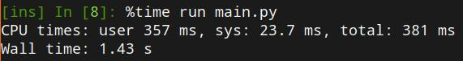

# Wikipedia Scraper
[](https://www.python.org/)


## 🏢 Description
The script for this project automates the collection of data on countries and their political leaders from various sources, including APIs and Wikipedia. 
It processes this information, focusing on aspects like name, office, and additional details, and compiles it into a structured JSON or CSV file. 
This approach emphasizes key programming concepts such as web scraping, data manipulation, and file operations, aiming to provide a comprehensive dataset for educational or analytical purposes.


## 📦 Repo structure

```
.
├── data
│   └── leaders_data.csv
├── main.py
├── README.md
├── requirements.txt
└── src
    ├── __init__.py
    └── scraper.py
```

## 🛎️ Usage

Clone the repository to your local machine.
```
git clone https://github.com/metavraag/wikipedia-scraper.git

```
This command clones the project into a `wikipedia-scraper` directory in your current location.

## Set Up a Virtual Environment

Navigate to the project directory:
```
cd wikipedia-scraper
```
Create a virtual environment:
```
python3 -m venv env
```
Activate the virtual environment:

- On Unix/macOS: `source env/bin/activate`
- On Windows: `.\env\Scripts\activate`

### Install Dependencies

With the virtual environment activated, install the required dependencies:
```
pip install -r requirements.txt
```


To run the script, you can execute the `main.py` file from your command line:
```
python main.py

```


 Upon executing python main.py, the script initializes a WikipediaScraper with a specific URL, retrieves a list of countries, and fetches their leaders' details. It then concurrently gathers the first paragraph of each leader's Wikipedia page, enhancing efficiency through parallel processing. 

Finally, the script compiles this data into a CSV file, with an optional capability to save it as a JSON file instead. This process effectively combines web scraping and concurrent programming to aggregate and store information on political leaders.

Leveraging multithreading, the script operates with remarkable speed, completing its tasks within 1-2 seconds. This efficiency is achieved by concurrently fetching data for multiple leaders, significantly reducing the overall execution time.



The script incorporates two methods for data extraction: parsing Wikipedia pages using Beautiful Soup (`get_first_paragraph`) and leveraging a hidden API for direct data retrieval (`get_first_paragraph_api`). 
These approaches are encapsulated within the `WikipediaScraper` class methods, allowing for versatile data gathering strategies to enrich the dataset with detailed leader profiles.

The script saves the results of the scraping process into the data folder, where the collected data about countries and their political leaders, including the first paragraphs from their Wikipedia pages, is stored in a CSV file named leaders_data_api.csv. This structured storage allows for easy access and analysis of the scraped data.


## ⏱️ Timeline

This project took 3 days for completion.

## 📌 Personal Situation
This project was done as part of the AI Boocamp at BeCode.org. 

Connect with me on [LinkedIn](https://www.linkedin.com/in/ivan-panafidin-8937b62b1/).

